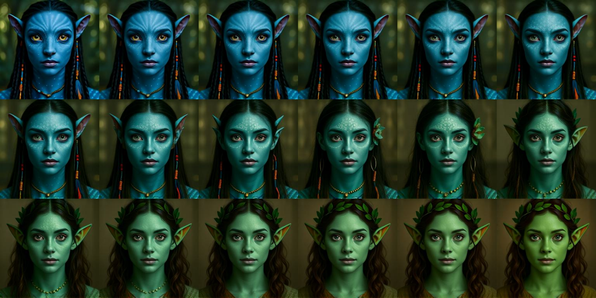
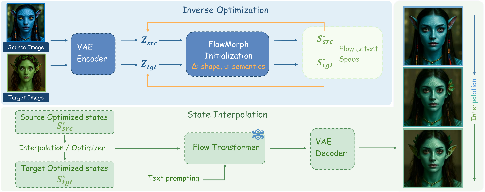

# FlowMorph: Revealing an Optimizable Flow Latent Space for Controlled Image Morphing

<p align="center">
  <a href="https://openaccess.thecvf.com/content/WACV2026/papers/Zheng_FlowMorph_Revealing_an_Optimizable_Flow_Latent_Space_for_Controlled_Image_WACV_2026_paper.pdf"></a>
  <a href="https://openaccess.thecvf.com/content/WACV2026/papers/Zheng_FlowMorph_Revealing_an_Optimizable_Flow_Latent_Space_for_Controlled_Image_WACV_2026_paper.pdf"></a>
  <a href="./LICENSE"></a>
  
  
</p>

<p align="center">
  <b>
    <a href="mailto:yanzheng@utexas.edu">Yan Zheng</a><sup>1,*</sup>
    &nbsp;·&nbsp;
    <a href="mailto:arloyang397@gmail.com">Yi Yang</a><sup>2,*</sup>
    &nbsp;·&nbsp;
    <a href="mailto:lanqing.guo@utexas.edu">Lanqing Guo</a><sup>1</sup>
    &nbsp;·&nbsp;
    <a href="mailto:atlaswang@utexas.edu">Zhangyang Wang</a><sup>1</sup>
  </b>
  <br>
  <sup>1</sup>University of Texas at Austin &nbsp;&nbsp;
  <sup>2</sup>University of Edinburgh
  <br>
  <sub><sup>*</sup>Equal contribution. Published at <b>WACV 2026</b>.</sub>
</p>

<p align="center">
  <b>📄 <a href="https://openaccess.thecvf.com/content/WACV2026/papers/Zheng_FlowMorph_Revealing_an_Optimizable_Flow_Latent_Space_for_Controlled_Image_WACV_2026_paper.pdf">Read the paper (open access PDF)</a></b>
</p>

<p align="center">
  
  <br>
  <sub><b>Examples of image morphing obtained via FlowMorph.</b> Given a source image (top-left, <i>Avatar-like</i>) and a target image (bottom-right, <i>elf-like</i>), FlowMorph produces a sequence of intermediate images in row-wise order. Successive transitions maintain overall geometric consistency while gradually adjusting appearance and semantic attributes.</sub>
</p>

---

## ✨ TL;DR

FlowMorph is a **training-free** framework for geometry-preserving and
semantics-aware image interpolation on top of any frozen rectified flow
model. The key idea is to separate two factors inside the flow model's
latent space:

- an **offset `Δ`** that captures shape and geometry, and
- a **one-step vector `u`** that carries semantic meaning.

Keeping the flow network frozen, we only optimize `(Δ, u)` at a single
noise level. This exposes a stable and interpretable neighborhood around
each image and unlocks two complementary modes:

1. **Flow-Optimizer** — direct target fitting; also supports multi-objective
   compositions with a sum-of-losses objective.
2. **Flow-Interpolation** — decoupled mixing of `Δ` (linear) and `u`
   (SLERP on direction + linear on norm) for smooth, coherent morphs.

<p align="center">
  
  <br>
  <sub><b>FlowMorph pipeline.</b> (Top) Inverse optimization fits <code>(Δ, u)</code> so that the one-step reconstruction matches the encoded latent. (Bottom) State interpolation mixes offsets linearly and one-step vectors spherically, then pushes the interpolated state through the frozen flow transformer and VAE decoder.</sub>
</p>

---

## 🖼️ Result gallery

<p align="center">
  
  <br>
  <sub><b>Result gallery.</b> FlowMorph produces natural, faithful morphs across object, pose and scene transitions.</sub>
</p>

---

## 🚀 Getting started

### 1. Install

```bash
git clone https://github.com/your-org/FlowMorph.git
cd FlowMorph
python -m venv .venv && source .venv/bin/activate
pip install -r requirements.txt
```

Hardware: the paper uses a single NVIDIA A6000 (48 GB) at 512 × 512.
Anything with ≥ 24 GB should work for FLUX.1-schnell; the depth-conditioned
FLUX.1-Depth-dev benchmarks may require more headroom.

### 2. Prepare image pairs

Drop `(source, target)` pairs into `data/pairs/` (see `data/pairs/README.md`).
For the standard benchmarks:

- **Morph4Data** — use the pairs released with [FreeMorph](https://github.com/fast-codi/FreeMorph).
- **MorphBench** — use the pairs released with [IMPUS](https://github.com/GoL2022/IMPUS) / [DiffMorpher](https://github.com/Kevin-thu/DiffMorpher).
- **Face-pair landmark eval** — we provide `tools/eval_landmarks.py`; see below for usage.

### 3. Run FlowMorph

```bash
# Flow-Optimizer (direct target fitting)
SOURCE_IMAGE=data/pairs/portrait_young.png \
TARGET_IMAGE=data/pairs/portrait_old.png \
bash scripts/run_flow_optimizer.sh

# Flow-Interpolation (decoupled (Δ, u) mixing, main Table 1 recipe)
SOURCE_IMAGE=data/pairs/cat.png \
TARGET_IMAGE=data/pairs/dog.png \
bash scripts/run_flow_interpolation.sh

# Multi-objective Flow-Optimizer (supplement Fig. multiobject)
bash scripts/run_multi_objective.sh
```

Each script writes a timestamped subdirectory under `outputs/` with individual
frames, an interpolation grid, and a `config.json` of the parameters used.

### 4. Reproduce baselines (Table 1 rows)

All baselines share the same FLUX backbone, scheduler and VAE decoder so
the comparison is apples-to-apples.

```bash
bash scripts/baselines/run_spherical.sh       # Spherical Interpolation (Table 1)
bash scripts/baselines/run_sdedit.sh          # SDEditInterp              (Table 1)
bash scripts/baselines/run_gaussian_init.sh   # GaussianInit (Fig. 5)
bash scripts/baselines/run_direct_latent.sh   # Single-variable ablation
```

For external baselines (IMPUS, DiffMorpher, FreeMorph, RF-Inversion) see
[`baselines/README.md`](baselines/README.md).

### 5. Reproduce ablations

```bash
bash scripts/ablations/run_backward_length.sh      # Section 5: backward length δσ
bash scripts/ablations/run_mixing_strategy.sh      # Section 5: mixing strategy (linear vs SLERP)
bash scripts/ablations/run_prompt_separation.sh    # Section 5: prompt / optimizer separation
```

### 6. Evaluation

```bash
# Perceptual & fidelity metrics (LPIPS_sum, PPL_sum; FID_mean when --real-dir is given)
python tools/eval_metrics.py outputs/flow_interp --recursive --pattern 'frame_*.png'

# Landmark-based geometry preservation (Flow-Optimizer eval on face pairs)
python tools/eval_landmarks.py outputs/flow_optimizer --recursive
```

---

## 🧠 Method in one page

See [`docs/METHOD.md`](docs/METHOD.md) for a self-contained derivation. In
one sentence:

> Parameterize the local neighborhood at a single noise level as
> `s(Δ, u) = (z_{t_i} + Δ) - (σ_last - σ_i) u`, minimize one-step
> reconstruction over `(Δ, u)` with the flow backbone frozen, then either
> optimize toward a target (Flow-Optimizer) or mix `(Δ, u)` across two
> endpoints with linear-for-geometry / SLERP-for-semantics (Flow-Interpolation).

---

## 📂 Repository layout

```
FlowMorph/
├── flowmorph/                     # Core library
│   ├── flux_optim.py              # FluxOptimizer: (Δ, u) parameterization
│   ├── pipeline_flux.py           # FluxPipeline patch (caches prompt embeds)
│   ├── flow_optimizer.py          # Flow-Optimizer (+ multi-objective)
│   ├── flow_interpolation.py      # Flow-Interpolation (decoupled mixing)
│   ├── prompt_interpolator.py     # optional prompt interpolation helpers
│   └── utils.py                   # SLERP, image grid, etc.
├── baselines/                     # Table-1 baselines + ablations
│   ├── spherical_interp.py
│   ├── sdedit_interp.py
│   ├── gaussian_init.py
│   └── direct_latent.py
├── scripts/                       # Shell entry points
│   ├── run_flow_optimizer.sh
│   ├── run_flow_interpolation.sh
│   ├── run_multi_objective.sh
│   ├── baselines/                 # per-baseline shells
│   └── ablations/                 # per-ablation shells
├── tools/                         # Evaluation
│   ├── eval_metrics.py            # LPIPS_sum / FID_mean / PPL_sum
│   └── eval_landmarks.py          # MediaPipe landmark displacement
├── configs/default.yaml
├── data/pairs/                    # put your (source, target) pairs here
├── docs/METHOD.md                 # self-contained method reference
└── assets/                        # paper figures (teaser, pipeline, gallery, ...)
```

---

## 📝 Citation

If you find FlowMorph useful, please cite:

```bibtex
@inproceedings{zheng2026flowmorph,
  title     = {FlowMorph: Revealing an Optimizable Flow Latent Space for Controlled Image Morphing},
  author    = {Zheng, Yan and Yang, Yi and Guo, Lanqing and Wang, Zhangyang},
  booktitle = {Proceedings of the IEEE/CVF Winter Conference on Applications of Computer Vision (WACV)},
  year      = {2026}
}
```

## 🙏 Acknowledgements

FlowMorph builds on the FLUX rectified-flow backbone from Black Forest Labs
and the open-source interpolation benchmarks introduced by IMPUS,
DiffMorpher and FreeMorph. We thank the authors of those works for making
their code publicly available.

## 📫 Contact

Open an issue, or reach out to the authors at `yanzheng [at] utexas [dot] edu`.
